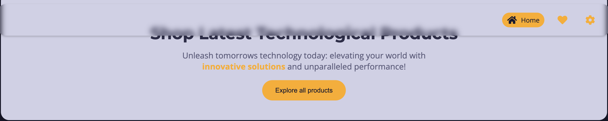

# Project Documentation for a Front-End Task

## Overview

This project implements a simple web application with three primary pages: a home page displaying a list of posts, a favorites page for users to view their favorited posts, and a settings page for dark mode settings. Users can mark posts as favorites by clicking a heart icon, which saves the post to local storage. The heart icon will be highlighted for favorited posts.

## Features

- [Mock Data Implementation](#mock-data-implementation)
- [API Simulation](#api-simulation)
- [Home Page](#home-page)
- [Favorites Page](#favorites-page)
- [State Management](#state-management)
- [Local Storage Management](#local-storage-management)
- [Notifications](#notifications)
- [Responsive Design](#responsive-design)
- [Skeleton Loading](#skeleton-loading)
- [Sort and Search Functionality](#sort-and-search-functionality)
- [Dark Mode Settings](#dark-mode-settings)

## Mock Data Implementation

Created a set of mock data representing posts.

```javascript
const posts = [
    {
        id: 1,
        title: "iPhone 12",
        imageUrl: "https://picsum.photos/600/300?random=1",
        body: "iPhone 12, used for 3 months, excellent condition.",
        price: 700,
        likesCount: 15,
        commentsCount: 3,
        tags: ["iPhone", "Apple", "Electronics"],
        user: {
            name: "Ahmed Kamal",
            imageUrl: "https://picsum.photos/100/100?random=1"
        }
    },
    // Additional posts
];
```

## API Simulation

Developed functions to simulate API interactions for fetching, adding, updating, and deleting posts.

```typescript
import posts from '@/data/posts';
import { Post } from '@/types/Post';

interface ApiResponse<T> {
    status: number;
    message: string;
    data?: T;
}

// Example function to fetch all posts
export const fetchPosts = async (): Promise<ApiResponse<Post[]>> => {
    return new Promise((resolve) => {
        setTimeout(() => {
            resolve({
                status: 200,
                message: 'Posts fetched successfully',
                data: posts
            });
        }, 1500); // Simulated delay of 1.5 seconds to show skeleton loading
    });
};
```

## Home Page

The home page displays posts with sorting and filtering functionality. It includes skeleton loading and shimmering effects for images. The main component uses Zustand for state management.

## Favorites Page

Displays favorited posts stored in local storage.


## State Management

Utilized the Zustand library for state management.

## Local Storage Management

Implemented utilities to handle saving and retrieving favorite posts.

```typescript
import { Post } from '@/types/Post';

export const getFavoritePosts = (): Post[] => {
    const favorites = JSON.parse(localStorage.getItem('favorites') || '[]');
    return favorites.map((fav: string) => JSON.parse(fav));
};

export const isFavoritePost = (postId: number): boolean => {
    const favoritePosts = getFavoritePosts();
    return favoritePosts.some((favoritePost: Post) => favoritePost.id === postId);
};

export const addFavoritePost = (post: Post): void => {
    const favoritePosts = getFavoritePosts();
    favoritePosts.push(post);
    localStorage.setItem('favorites', JSON.stringify(favoritePosts.map((post: Post) => JSON.stringify(post))));
};

export const removeFavoritePost = (postId: number): void => {
    const favoritePosts = getFavoritePosts();
    const newFavorites = favoritePosts.filter((favoritePost: Post) => favoritePost.id !== postId);
    localStorage.setItem('favorites', JSON.stringify(newFavorites.map((post: Post) => JSON.stringify(post))));
};
```

## Notifications

Added toast notifications for user actions.


## Responsive Design

Implemented a responsive navbar using glassmorphism design.




## Skeleton Loading

Implemented skeleton loading for posts to simulate loading data from an API. Added a shimmering effect for image loading placeholders until they are fully loaded.


## Sort and Search Functionality

Implemented sorting and search functionality for posts.


## Dark Mode Settings

Added a settings page that includes an option for dark mode.

 
 